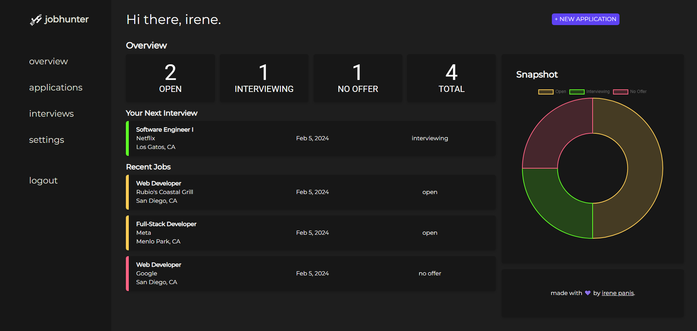

# Jobhunter
### Job hunting just became a whole lot easier.

`Jobhunter` was created to facilitate application-tracking during the job hunt. From bootcamp graduates to college graduates, `Jobhunter` is designed to help make the application process a little less painful by allowing users to keep an easily-accessible archive of where one has applied and when.

Made for job hunters by a job hunter.

### [Deployed site](https://jobhunterapp-345c7e7b566e.herokuapp.com/)

## Usage & Preview
Users can get started by creating an account. Then, they are taken to their dashboard where they can record new applications (consisting of the position title, company, and location, with the option to add custom notes) and view their past application data at a glance.

The full list of applications can be viewed under the **Applications** tab. Each application may be edited or deleted. All inputted information for an application may be edited, including its status (by default this option is listed as 'open', but may be changed to 'interviewing' or 'no offer'). 

Listing an application as 'interviewing' allows the user to record an interview date and interview location. Each status has a corresponding color to allow for easier viewing-- yellow for 'open', green for 'interviewing', and red for 'no offer'. Applications listed as 'interviewing' may be viewed in **Interviews**.

User information, such as display name, email, and password may be changed in **Settings**.

## Technologies

[source](https://github.com/alexandresanlim/Badges4-README.md-Profile?tab=readme-ov-file#how-to-use)

## About Me
Hi! I'm Irene. :) I'm a recent graduate of The Coding Boot Camp @ UCSD where I learned to build full-stack web applications using the MERN stack. Right now I'm building cool stuff to revamp my portfolio and master technologies old and new.

